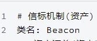

# 类型

## 类型

类型名: 我们在系统文案中些的名字

类名: 在程序中的名字

**程序基础类型**

| 类型名 | 类名                | 值                     | 介绍                | 符号 |
|--------|---------------------|------------------------|---------------------|------|
| 词组/句子 | String              | "今天我捡到了一个苹果" | 你想要说的一句话,必须用引号包裹. 短与12的用"词组",长于12的用"句子"    |      |
| 是非   | bool                | 是,非                  | 是,或者不是,单选题? |      |
| 数字   | int,byte,long,float | 1234                   |                     |      |

**拓展类型**

| 举枚     | enum           | 性别:  男,女,双性,其他               |                                             |   |
|----------|----------------|--------------------------------------|---------------------------------------------|---|
| 名单     | List\<\>       | [小王,小红,小白,小明]                | 我们有一组人, 里面有小王,小红,小白,小明     |   |
| 字典     | Dictionary\<\> | [{"Jack","小王"},{"Micheal","小玲"}] | "Jack",对应着"小王". "Micheal",相当于"小玲" |   |
| 对象/东西 | Class/Struct   |                                      | 其他你定义的类型                            |   |

```
对象-人{
    词组-名字
    身份证-身份证
}

对象-身份证{
    词组-名字
    数字-证件号
    句子-地址
}
```
**游戏基础类型**

一般,美术类我们都以 资产名称进行替代,也就是资产汇总表的表头.

| 类型名  | 类名           | 值 | 类目   | 介绍                                |
|---------|----------------|----|--------|-------------------------------------|
| 2维向量 | Vector2        |    | 数学类 |                                     |
| 3维向量 | Vector3        |    | 数学类 |                                     |
| 颜色    | Color          |    | 数学类 | color其实是一个三维向量, 储存着 rbg |
| 材质    | Material       |    | 美术类 |                                     |
| 模型    | Mesh           |    | 美术类 |                                     |
| 动画    | Animation      |    | 美术类 |                                     |
| 音乐    | Audio          |    | 美术类 |                                     |
| 图片    | Texture2d      |    | 美术类 |                                     |
| 特效    | ParticleSystem |    | 美术类 |                                     |

**自定义对象**

自定义对象的名字是你自己取的.

对应类名 一般为 对应英文名

在我们定义一个机制的时候,比如说 "物品机制",我们就默认他定义了一个
"物品"这个类型, 这里的物品,指的是物品机制

一般来说,一个研发文案对应着一个机制

其命名方式为机制-模块-机制名字

一般其文案的内部有英文名字



恭喜你,定义了一个 新的类型, 叫做信标

## 接口(TODO)

接口,在面向对象中是非常好用的. 一般描述某个属性,
比如说你满足一定的条件,即可被归类为这种类.

但是,我们把这些功能都分散到组件中去了...
