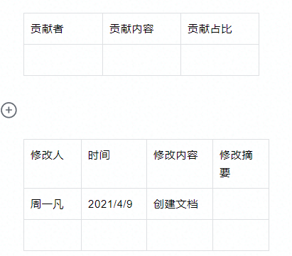

# 机制和资产

## 机制的概念

**机制与规则**

机制,一般被认为是游戏规则组成

比如说你定义了这里有一些箱子 箱子可以打开,获得物资,
这个的确是属于游戏规则的范畴.

但是按照这样子划分,游戏规则会显得过于庞大.

因此我们将游戏规则,归类到了系统.

我们的机制为 可复用的规则即(Actor)

我们的机制,就单纯的划分为 Actor, 即组成游戏的每一个元素

**机制与资产**

资产,即这类元素的衍生.

比如说 箱子他是机制, 箱子这个机制又有 大箱子,小箱子这些资产.

**机制与特性**

特别小的机制,我们把他称作特性, 由于比较小,他只有设计文案,没有机制文案 .
没办法,太简单了. 记得搞一个文件夹几种储存就可以了

**机制与组件**

机制是组件的合集

GamePlay框架中,他把玩家的数据分为了PlayerState,
也就是说玩家本身,基本上是不含任何数据的.

玩家本身就是一个.

ACharacterPlayer

-   UCharacterMovementComponent 玩家移动相关的组件

-   UPlayerState 玩家的数据

-   USkeletalMeshComponent 玩家的模型

-   UCapsuleComponent 玩家的碰撞体

## 机制的编写

文档名字: 机制(或"资产")-\<模块\>-\<机制名字\>-[资产名]

```
C++
# 箱子机制
类名: Chest
网络通信: 是 /如果是联机,那么咱们得有这个
权限: 服务器 
## 需求分析
这个箱子可以分为背包, 打开这些东西...
## 资产汇总 有什么美术资源
| 变量 | 资源名称 | 资源类型 | 资源描述 |
| ------ | ------ | ------ | --- |
| 箱子模型 | SM_Resource | StaticMesh | 箱子的模型,有上下 |
| 箱子破坏特效 | PS_Resource_Break | ParticleSystem | 资源整个被破坏的粒子 | 
## 构成 这个箱子是怎么组成的
**组件-背包**
格子三个

**组件-可攻击**
受到攻击:
- 当前生命值-受到的生命值, 生命值为0
 - 破坏DestruibleMesh.
 - 播放特效: %箱子破坏特效% /引用上面的破坏特效

## 编辑器  在detail（inspect）视图中是什么样的

`\`\`
Chest: AActor
- 模型: MeshComponent, Mesh=DM_Resource 
- 背包: InventoryComponent //上面已经定义背包组件了
- 可攻击: DamagableComponent //上面的可攻击组件
`\`\`

```
**版本信息**

一般你可以在开头看到这个东西.

第一项, 贡献记录: 用于绩效统计的,
有的时候文档可能会由多个人完成,一般由创建者决定

第二项,修改记录: 用于记录修改,方便版本管理用的



**机制信息**

机制的内容, 大致介绍了一下这个机制是什么样的.

类名: 这个机制对应的Actor的名字, 一般为对应英文.

网络通信: 这个东西是否需要联网同步

-   权限: 这个东西是 以服务器为主 还是客户端为主?

简介: 简单的介绍这个机制

模块: 如果有系统,则与系统相同,
如果没有所属系统,那么这个机制,就可以单独"成块",一般为机制中文名字


```
类名: Chest
网络通信: 是 /如果是联机,那么咱们得有这个
权限: 服务器 
模块: 箱子
简介: 这是一个可以被玩家打开的箱子

```

**需求分析**

这个机制你需要创造什么组件进行完成.

**参考文档**

文档地址: 对应文档位置的超链接

文档类型:

-   组件 这个机制是由那些组件组合的

-   机制 有没有和这个机制有关的机制,相关的依赖

-   系统 这个机制是否属于某个系统的一部分

-   设计文档 传统的策划文档,一般美术类的示例都在里面,

-   教程/指南 一般为相关特性在程序方面怎么执行的教程位置

**需要注意的是, 只写"我们使用的",不写"我们被使用的",
简单的说,如果你是属于某个系统的一部分,那么你不需要在引用文档中提到它,
系统会在他自己的引用文档中提到你**

文档简介: 简单的介绍一下这个文档

```
| 文档地址 | 文档类型 | 介绍 | 
| ------ | ------ | --- |  
| 背包拖曳教程 | 指南 | 怎么使用UE4制作出背包拖曳的效果 |

```

**资产表**

针对 所需要的制作的资产进行统计,并定义"变量". 设计文档中一般会有配图

变量: 参考前面的变量, 别忘了引用的时候加上 %%, %箱子模型%

资源名称: 按照我们的资产管理规范,这个资源的命名

-   前缀\_模块/类型\_名称\_变种

工作类型: 简单的说,这个是动画?特效?还是由谁制作, 参考我们的工作流

-   粒子特效工作流

-   片元/顶点工作流

资源类型:

-   基础类型, 参考我们的UE4指南,里面记载了所有类型

-   自定义类型, 我们自己创建的机制,资产,都属于这个类型,为了方便理解,就写
    机制/组件 名字的 父名就可以了

-   UActorCompoent

-   AActor

-   USceneComponent

-   如果是资产,就写机制名字

-   如果是组件,写模块名字

-   机制,或者系统,也是写模块名字

```
| 文档地址 | 文档类型 | 介绍 | 
| ------ | ------ | --- |  
| 背包拖曳教程 | 指南 | 怎么使用UE4制作出背包拖曳的效果 |
```

**构成-总览**

下图的意思是,这个箱子组件是由1个模型组件,1个背包组件,和一个可攻击组件 组成的

```
Chest: AActor //机制名称: AActor
+ 箱子模型:UMeshComponent Mesh=%箱子模型% 
+ 背包组件:UInventoryComponent 
+ 另一个背包:UInventoryComponent
```

``` 
新箱子: Chest //资产名称: 机制名称
* 箱子模型: UMeshComponent, Mesh=%新箱子模型% 
<符号> <组件变量:组件名字> <组件设置>
```

```
隐形箱子: 箱子
- 箱子模型
+ 碰撞体:UBoxComponent

```

**机制定义**

机制定义一般写在第一行

-   \<机制名字\>:\<AActor\>

-   \<资产名字\>:\<机制名字\>

**组件定义**

其他行,一般一行为一个组件

-   \<符号\> \<组件变量\>:\<组件名字\> [组件设置]

需要注意的是,比如说你需要一个碰撞体组件,但是不确定是正方形碰撞体,还是椭圆形碰撞体.你就写
碰撞体组件 就可以了,记得在组件名字加一个"?"

所有类型的碰撞体,都是UShapeComponent的子类

```
+ 碰撞体:?UShapeComponent disabled
```

**符号**

-   \- 删除 意思是在之前的机制上,删除这个组件

-   \+ 新增 在志气的机制上,新添加这个组件

-   重写 修改原机制的设置

**组件信息**

\<组件变量\>: 你觉得怎么好听就怎么取, 你可以写 "背包组件",也可以写
"掉落表",也可以写"背包"

\<组件名字\>: 组件的名字,这个必须得符合组件的英文名.

需要注意的是,如果一个机制是以组件的形式加入到这个机制中去,那么我们编写的不是

USubActorComponent,而是直接写对应机制(资产)的名字.

**组件设置**

组件设置,为组件在Detail视图中的设置

如果比较长,就直接采用"属性设置"

需要注意的是,比如说碰撞体这些大小,偏移,一般都由关卡自己设置的东西,直接忽略不写就可以了
:d

通用的

-   Disabled 组件的状态为关闭, 没有写disabled都为enabled

UI类

-   Bush=%图片% 这个UI的图片是什么

模型类

-   Mesh=%模型% 这个模型组件的模型是什么

**属性设置**

这个构成,就比较简单了.

这些字段,都是我们自己对组件定义

编写格式一般为将对象以YML格式的反序列化结果编写


```md
**背包组件**
格子: 3
- 石头 1
- 木头 1

```

```md
**<组件名字>** //组件名字,就是你在总览中写的组件的名字
格子: 3 //属性赋值 

```