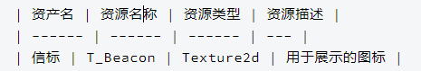

# 变量

## 变量的定义

**一般定义**

-   类型名字 变量名字

类型名字: 参考上一篇类型

变量名字: 我们怎么称号这个变量

**特殊定义**

特殊定义,主要是针对字典与列表, 他们单独不属于类型

列表: [类型名字]

-   字典: {类型a,类型b}

\*

| 示例               | 介绍                                          |
|--------------------|-----------------------------------------------|
| {身份证,人} 花名册 | 定义了一个 身份证与人 对应的 叫做花名册的变量 |
| [人] 一群人        | 定义了 很多个 "人"组成的 一群人变量           |

## 美术资产

一般,在每一个机制的文档中,你可以找到这种样子的表格.

这个的意思: 定义了 一个 叫做 信标的变量.

这个%信标% 指的是T_Beacon 这个图片

## 变量的使用

为了方便识别别忘了在使用变量的时候加一个"%%",

比如说:

-   删除图片: %信标%
