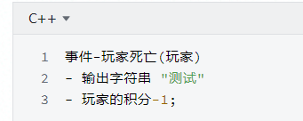
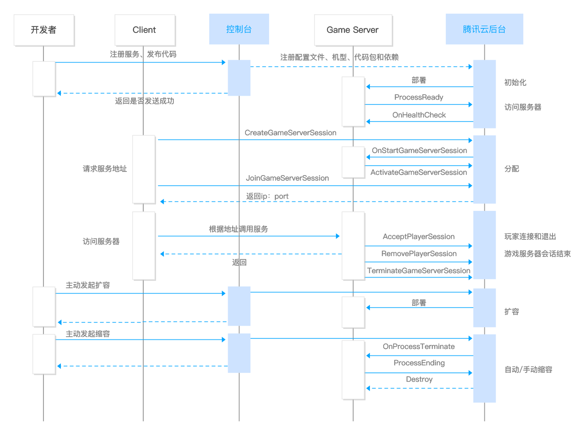

# 框架,系统,游戏规则

## 基本分类

框架与系统与规则,只是我们为了区分而进行的简单分类,有的时候,我自己都不太分清楚,
凭个人感觉, 比较开放的,我们都叫他框架,其他的都叫系统.

**为了分类的节省时间,我们只统一在策划案中只分为两类,
规则与系统,(框架被纳入到系统中去了)**

规则: 与游戏进度有关的系统.

一般把游戏机制,认为就是游戏的规则,没有错,但是会显得游戏规则过于庞大.

我们的规则,指的是与游戏进度相关的规则.

框架: 简单的规定了数据的传输方式. 能够被其他人使用,并拓展的

系统: 在框架的基础上. 拥有统一的逻辑处理的.
一般只要是我们针对游戏编写的,都叫做系统

**系统**

系统指的也是数据的传递方式,你必须按照引擎设置的来.

比如说玩家输入,是针对"键盘"输入到"程序" 中的数据获取的方式, 我们叫他输入系统.

**框架**

只是指数据的传递方式,
比如说你造成伤害,得调用这个"XXX.OoDamage",这个东西是我们可以自己定义的.

比如说GamePlay框架, 是规定好了大致的处理方式, 具体的东西,得我们自己实现,
我们叫他框架

框架指的是数据的传输方式, 一类数据传输的方式

-   GamePlay框架

-   UE4伤害框架

-   Netty

-   Protobuf

伤害框架中,你规定了,你要对某一个东西造成伤害,则需要调用他的OnDamageRec()

你对他造成的伤害信息,必须储存在DamageInfo这个类中

-   IDamageSource

-   Void OnDamageRec(DamageInfo damageInfo)

-   DamageInfo

-   Float amount

**规则**

游戏规则,属于系统的一种, 一般至少拥有一个机制,用于储存当前的"完成情况"

机制,是组成游戏中每一个东西.都属于规则的一部分. 但是那样子定义太过于繁杂,

因此我们将游戏规则定义为:
贯穿本局游戏的,且独立存在的,系统,叫做游戏规则.这种系统,一般拥有一个
表示"进度"的组件,挂在GameState上

系统与游戏规则：

我们将只场景中只出现一个的，切贯穿全局游戏的，叫做游戏规则．

－ 冬日计划中的 事件的发生： 每隔一定时间，将会引发游戏事件

－ 冬日计划中投票的统计：每隔一定时间，都会开始统计

## 系统编写

文档名字: \<系统(或"规则")\>-\<模块\>

```
# 伤害系统
模块名: Combat
介绍: 伤害系统,由伤害给予者,对可受到伤害的东西,造成伤害.
伤害的数值,伤害的类型,不确定

//上面的东西,就是需求分析咯.
//需要注意的是,这个伤害系统是我们为Unity搞的,UE4有自己的,比我们还要好
## 组成
//由于过于简单,我就用 伪代码带过
//[吃瓜],如果你开心,你可以把这些东西做成组件
### 伤害给予者

public interface IDamageSource
{
 String GetName();
  //武器,远程 就是发出者和背包的拥有者
        //陷阱就是放置着
 PlayerProfile GetPlayer();
}

### 伤害信息
class struct DamageInfo{
//伤害来源,比如说玩家丢的地雷
IDamageSource DamageSource
//造成攻击的玩家, 可为null(动物)
PlayerProfile player
//可为null,如果是近战(射线检测),那么就有
RaycastResult? hitResult;
//伤害数量
float ammount;
}

### 伤害接收者

public interface IDamageReceiver{
void OnDamageReceive(DamageInfo damageInfo);
}


### 伤害类型
public enum DamageType: byte
{
        //环境 伤害类型是环境,伤害给予者是玩家自己
        //近战 近战只能是动物和玩家给予的
        //陷阱 只能是玩家给予的
        //投掷物 只能是玩家给予的
  Environment,Melee,Trap,Projectile
}
    
## 时序图

由于时序图实在难画,你们自己脑部一下吧, 建议去找周一凡,他什么都会
- 推荐mermaid.js

1. 伤害给予者, 创建类 "伤害信息"作为调用伤害接收者的"受到伤害"方法的参数
2. 伤害接收者, 根据"受到伤害"这个方法,执行相应的东西

```

**基本信息**

模块名字: 顾名思义,这个模块的名字, 一般为 系统的英文名字

介绍: 简单的对这个系统进行介绍

```
模块名: Combat
介绍: 伤害系统,由伤害给予者,对可受到伤害的东西,造成伤害.
伤害的数值,伤害的类型,不确定

```

**系统组成**

一个系统,一般由这些东西组成

-   组件 这个系统相关的组件

-   机制 这个系统相关的机制

-   接口 一般使用接口,来判断这个组件,是否是属于我们这个机制的,
    这个接口里规定了一些固定的方法

-   事件

-   信息

**信息(数据结构)**

数据结构,也就是Struct, 或者说一些简单的 中间类 , 或者说纯数据的类.

信息非常小,和特性差不多,

你可以使用这个进行编写, 不过这个看上去非常傻,所以我们都用伪代码

```
结构体-物品堆:
- 物品类型 物品
- 数字 数量

```


比如

```
struct ItemStack{
Item item;
byte ammount;
}

```
如果有函数的话,就用类就可以了

```
class FItemStack{
Item item;
byte amount;
}

```

**接口**

接口,我们一般用的都是事件.

嘶.... 接口对于ECS有一些多余...

我们以前就是在玩家攻击的时候,看看有没有这个接口.

现在我们使用的是一个"可被攻击"的组件....

接口编写参考下面的 事件就可以了.

**事件(委托)**

[UE4发报机-EventDispatcher绑定事件\_harbinxxh的专栏-CSDN博客](https://blog.csdn.net/chinahaerbin/article/details/47350229)

为了方便编写, 我们省略事件的绑定.

事件的召唤

```
调用事件 <系统名>-<事件名>
```

事件体的定义

```yml
事件-<事件名>(参数A,参数B,参数C,...):
- 介绍: 总体介绍
- 参数A: 介绍
- 参数B: 介绍
- ....
```

```yml
事件-玩家死亡(玩家):
- 介绍: 当玩家死亡的时候召唤的
- 玩家: 死亡的玩家

```
事件的使用(我们的事件,编写出来,程序就会绑定)



**时序图**

这个是一个参考



如果你画不了图的话,也可以尝试用文字描述(不推荐).
