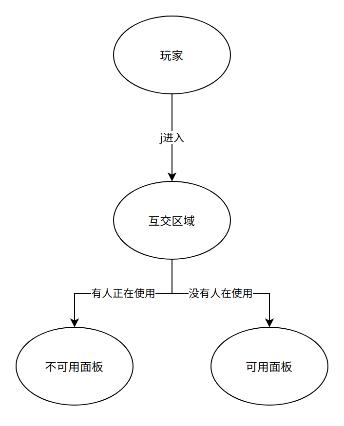

# 系统-互交

## 介绍

模块名: Interact

介绍:

-   当玩家靠近某个区域,会浮现出一个GUI,我们称作互交区域,玩家可以对互交区域中的按钮,进行点击.同时玩家执行相应的操作

-   由于是联网游戏,一个东西只可以同时被一个玩家进行互交.

当玩家在使用一个东西,我们称作玩家占领了那个互交区域

## 组成

### 组件-互交展示区域

**单机分析**

互交展示区域,必须和互交面板同时存在

当玩家进入的时候,根据玩家的情况,进行UI的展示

-   需要考虑有人正在进行互交的情况

**联网分析**

互交展示区域由客户端自行判断,我方只需要同步是否有人正在使用就可用了.

至于面板的存储,我们以预制体进行提供,不需要进行存储

### 组件-互交面板

**单机分析**

互交面板必须和互交展示区域同时存在

当玩家进入区域的时候展示的面板.

面板里有许多的按钮,

**联网分析**

存储的按钮,以预制体保存,不需要同步.

### 机制-互交按钮

**单机分析**

互交按钮,即存储这个按钮的 图标,互交时间,所需条件等

里面还存储了使用的逻辑

**联网分析**

至于能否使用,我们可用采用Authority权限进行.

互交面板的使用,其实就是发送Command,我们可以在玩家"占领"
的时候,assignClientAuthority, 没有占领的人,则无法发送Command就可以了.

## 时序图

**面板的展示(客户端)**

**面板的使用(客户端)**

1.  当玩家对一个面板中的按钮,点击,则开始使用

-   玩家进入"使用中"的状态

-   互交区域进入"被使用"的状态

1.  当 玩家停止使用, 玩家退出"使用中"的状态,让互交区域恢复到"静息状态"

2.  当 玩家 使用,达到一定时间,就判定为使用成功.

调用相关逻辑. 最常见的有两种.

1.  使用就立刻结束,比如说 安放陷阱, 破坏载具

2.  使用会持续, 比如说打开箱子

3.  使用结束,由玩家状态机处理,
    也就是"BInteracted.OnExit()",需要储存互交区域,并让互交区域回复静息状态.
