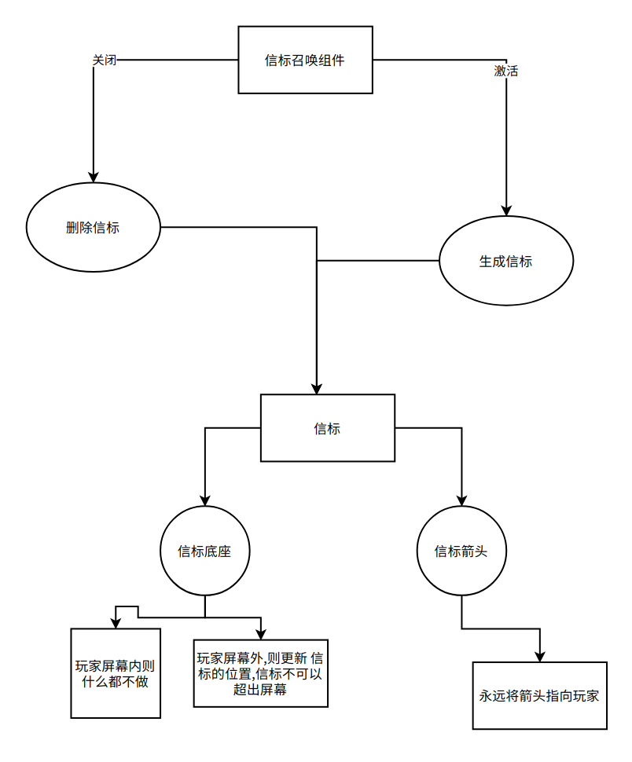

# 系统-信标

模块名: Beacon

介绍: 由于是Unity,因此我们需要

1.  信标召唤组件 和其他的GameObject在一起的,作为机制组件.
    储存着需要生成的信标资产

2.  信标机制 就是屏幕中的信标,进行位置的更新

## 参考文档

| 文档介绍           | 文档类型 | 文档地址            |
|--------------------|----------|---------------------|
| 召唤信标的信标组件 | 组件     | 组件-信标生成器 |
| 信标机制           | 机制     | 机制-信标           |

## 组成
```c++
class: Beacon
Replicated: false
Authority: Client
```
```
类名: 信标
网络通信: 否
权限: 玩家 
```
        
## 需求分析

**信标机制**

信标,用于在屏幕中显示，

**信标召唤组件**

生成信标的组件, 用于管理信标的出现与删除

**时序图**


